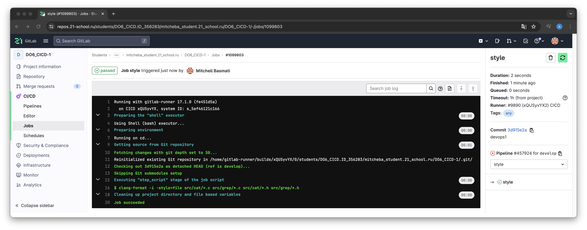

# Basic CI/CD

## Part 1. Настройка gitlab-runner

Поднять виртуальную машину Ubuntu Server 22.04 LTS.

Скачать и установить на виртуальную машину gitlab-runner.

Запустить gitlab-runner и зарегистрировать его для использования в текущем проекте (DO6_CICD).

## Part 2. Сборка

### Написать этап для CI по сборке приложений из проекта C2_SimpleBashUtils.

В файле gitlab-ci.yml добавить этап запуска сборки через мейк файл из проекта C2.

Файлы, полученные после сборки (артефакты), сохранить в произвольную директорию со сроком хранения 30 дней.

## Part 3. Тест кодстайла

### Написать этап для CI, который запускает скрипт кодстайла (clang-format).

Если кодстайл не прошел, то «зафейлить» пайплайн.

В пайплайне отобразить вывод утилиты clang-format.

## Part 4. Интеграционные тесты

### Написать этап для CI, который запускает интеграционные тесты из того же проекта.

Запустить этот этап автоматически только при условии, если сборка и тест кодстайла прошли успешно.

Если тесты не прошли, то «зафейли» пайплайн.

В пайплайне отобразить вывод, что интеграционные тесты успешно прошли / провалились

## Part 5. Этап деплоя

Поднять вторую виртуальную машину Ubuntu Server 22.04 LTS.

### Написать этап для CD, который «разворачивает» проект на другой виртуальной машине.

Запустить этот этап вручную при условии, что все предыдущие этапы прошли успешно.

Написать bash-скрипт, который при помощи ssh и scp копирует файлы, полученные после сборки (артефакты), в директорию /usr/local/bin второй виртуальной машины.

В файле gitlab-ci.yml добавить этап запуска написанного скрипта.

В случае ошибки «зафейлить» пайплайн.

## Part 6. Дополнительно. Уведомления

Настроить уведомления о успешном/неуспешном выполнении пайплайна через бота с именем «mitcheba DO6 CI/CD» в Telegram.

Скрипт бота

Добавляем в файл gitlab-ci.yml этап запуска

Вывод бота

